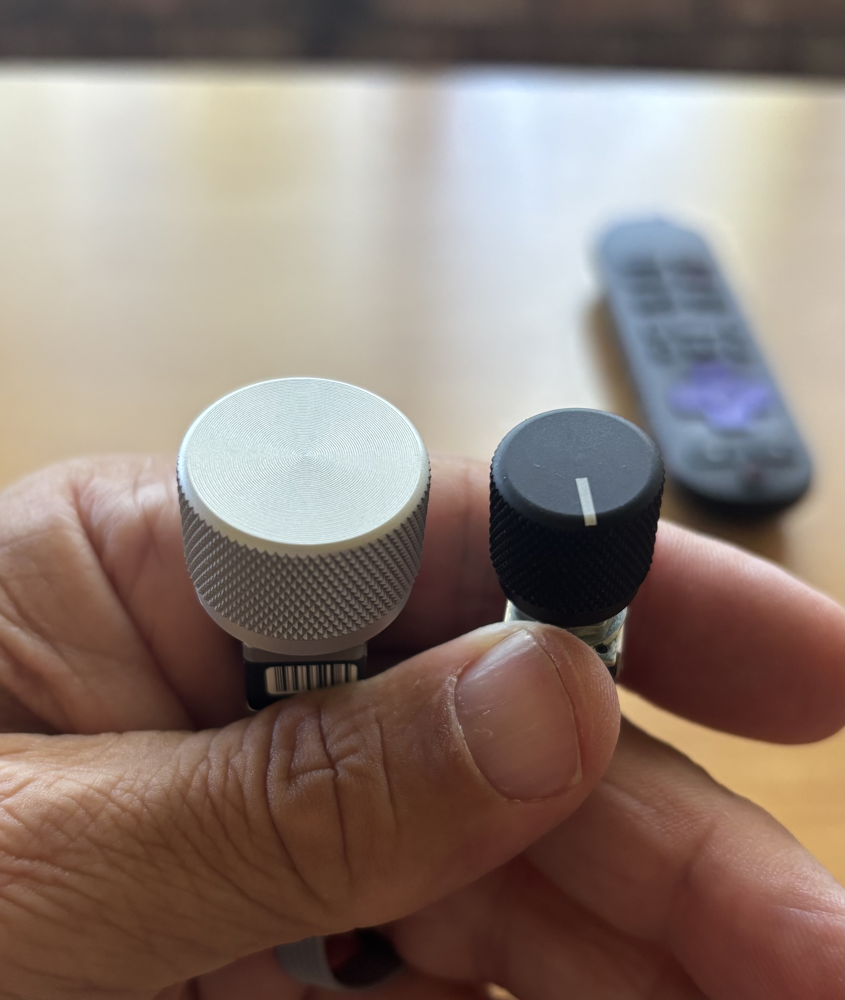
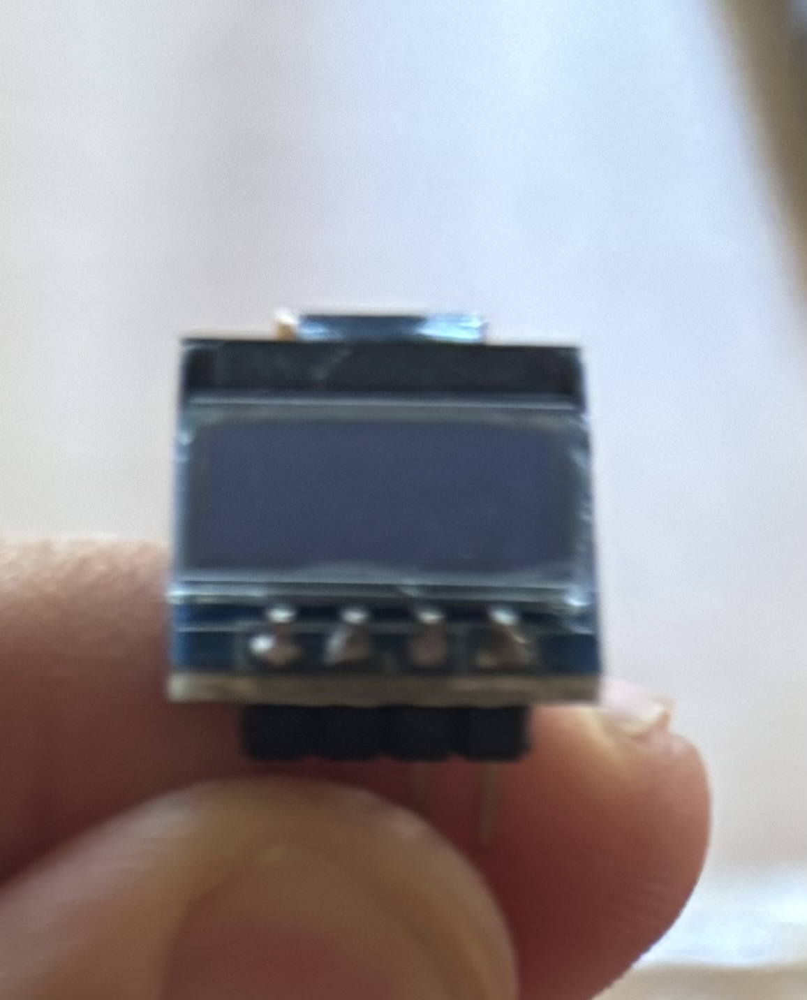
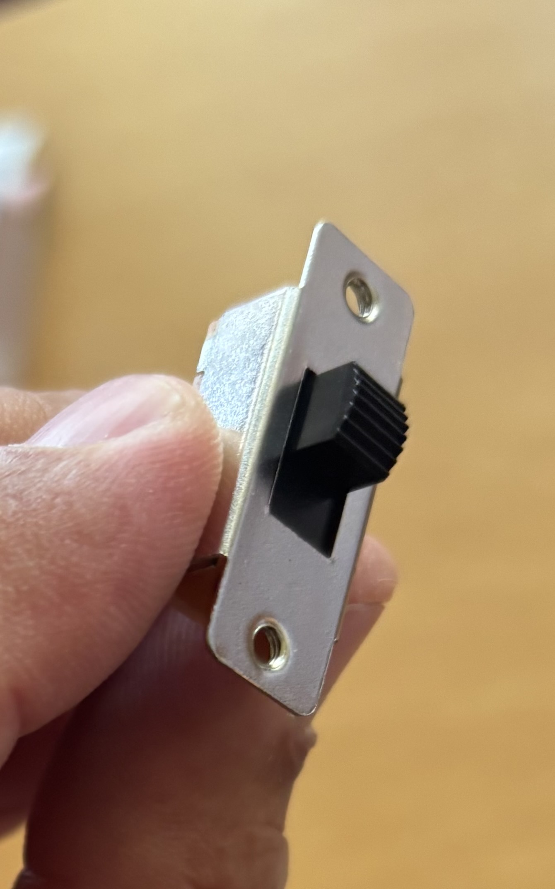
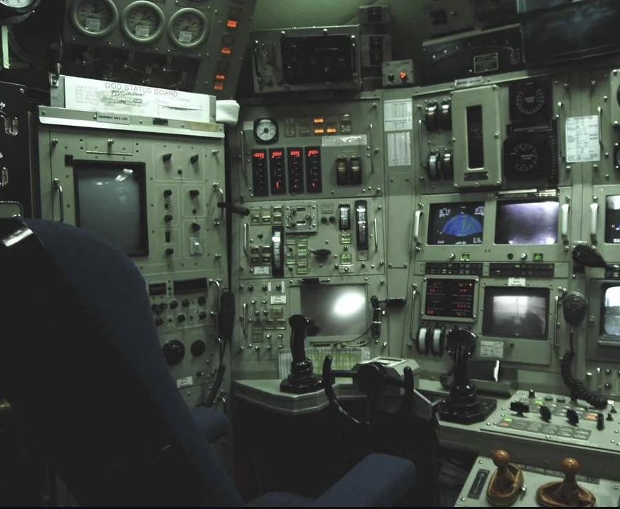
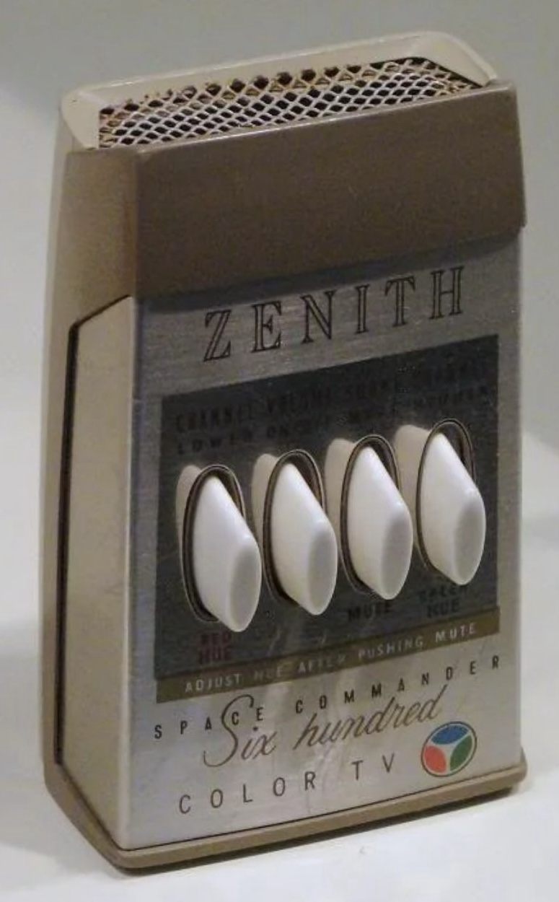

# THE CLONKER 10000
(extreme Beta version)

  

  
  &nbsp;&nbsp;
  

**`THE CLONKER 10000`** is a DIY “maker” project to build a custom remote control for my home theater and HiFi stereo desires.

*(Note: For now, imagine the above awesome controls mounted on a big-ass, honk’n brick of a case that will possibly weigh anywhere from .5 to 10 lbs. 😉)*

## Inspiration

I dislike modern remote controls. I think their designers have forgotten that humans are tactile beasts. I want a remote control that I can fumble around for in the dark, pick up, and use effortlessly. Yes, I am aware of “big button” products created for accessibility (very commendable) … BUT, I desire to handle REAL controls; I’d like my fingertips to caress beautiful metallic buttons and knobs I have only seen the likes of in other industries, i.e., HiFi stereo systems, nuclear submarines, etc. Some of the vintage TV remotes came close but, still, meh.

  
  &nbsp;&nbsp;
  

AND I want my tactile controls to please my aging ears with accompanying **audio** feedback like **CLONK**. Thus was born **The Clonker 10000** maker project … my realization that the only way I was going to get what I desire was to build it myself.

## Technical Details

This Beta version of The Clonker will be a WiFi-only device, containing an easily programmable FeatherS3[D] ESP32-S3 controller running Circuit Python. It will first be tested against my own equipment; Roku Ultra streaming devices, Denon AVR Amplifier Receivers, possibly LG TVs. I definitely plan to test it against Apple TVs and Amazon Fire sticks shortly after the initial birth. I have no plans on adding IR to it at this time.

More awesome stuff to come…
